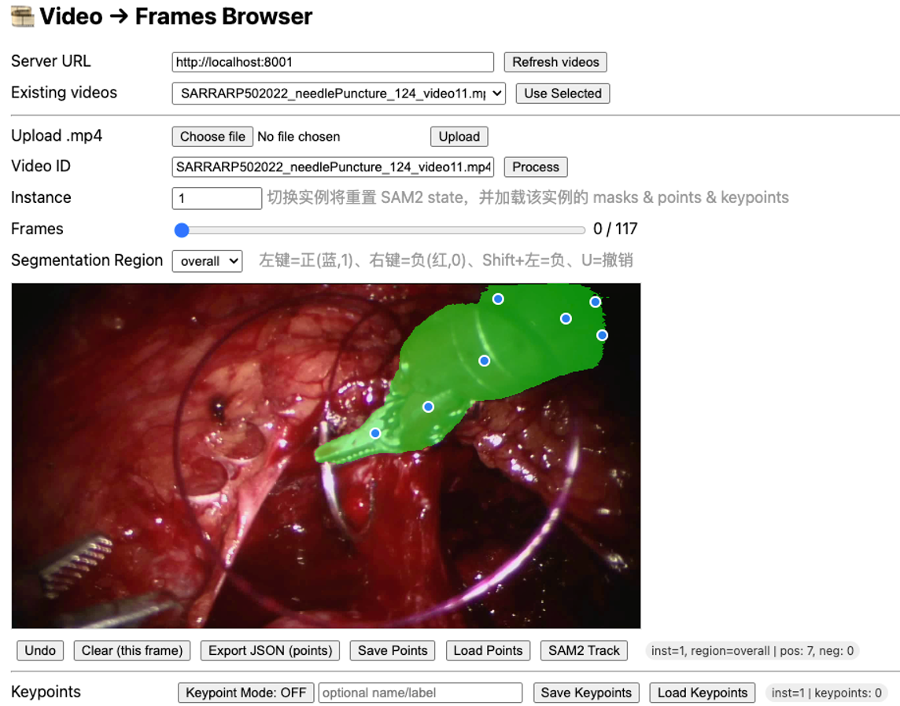

# 🎞️ Video → Frames Browser (Instances + Keypoints)

An interactive tool for video frame segmentation using SAM2, with support for multiple instances per video and keypoint annotation.
It includes a FastAPI backend and a lightweight HTML/JavaScript front-end served locally.

Access the app at 👉 http://localhost:8001/app/index.html

## 🧩 Prerequisites

- Python 3.10–3.11
- Git (to fetch SAM2 repo/checkpoints if needed)
- GPU (optional) — CUDA-enabled device recommended for SAM2 propagation

## ⚙️ Installation

### 1.1 Create and activate a virtual environment
If you haven't created a virtual environment with sam2 installed.
```bash
git clone https://github.com/lala-sean/SAM2_Annotation_Tool.git
cd SAM2_Annotation_Tool
conda create -n sam2 python=3.12 
conda activate sam2
```
 
### 1.2 Install core Python dependencies

```bash
pip install fastapi "uvicorn[standard]" numpy pillow opencv-python anyio pydantic==1.*
```

### 1.3 Install PyTorch

Choose one version that matches your platform and CUDA setup:

```bash
# CPU-only build
# pip install torch --index-url https://download.pytorch.org/whl/cpu

# CUDA 12.1 example:
# pip install torch --index-url https://download.pytorch.org/whl/cu121
```

💡 Check your CUDA version and select the matching PyTorch command from [pytorch.org/get-started/locally](https://pytorch.org/get-started/locally).

### 1.4 Install and set up SAM2

Ensure you have SAM2 locally. If you haven't installed SAM2 on your local device, then run following:
```bash
pip install -e .
```
Note:
1. It's recommended to create a new Python environment via [Anaconda](https://www.anaconda.com/) for this installation and install PyTorch 2.5.1 (or higher) via `pip` following https://pytorch.org/. If you have a PyTorch version lower than 2.5.1 in your current environment, the installation command above will try to upgrade it to the latest PyTorch version using `pip`.
2. The step above requires compiling a custom CUDA kernel with the `nvcc` compiler. If it isn't already available on your machine, please install the [CUDA toolkits](https://developer.nvidia.com/cuda-toolkit-archive) with a version that matches your PyTorch CUDA version.
3. If you see a message like `Failed to build the SAM 2 CUDA extension` during installation, you can ignore it and still use SAM 2 (some post-processing functionality may be limited, but it doesn't affect the results in most cases).

Please see [`INSTALL.md`](./INSTALL.md) for FAQs on potential issues and solutions.


Expected folder structure:

```
project/
├─ sam2/
│  └─ build_sam.py            # exposes build_sam2_video_predictor()
├─ configs/sam2.1/
│  └─ sam2.1_hiera_l.yaml
└─ checkpoints/
   └─ sam2.1_hiera_large.pt
```

If you don't have SAM2 yet:

```bash
git clone https://github.com/facebookresearch/segment-anything-2.git sam2
pip install -e ./sam2
```

Then download:
- Config → `configs/sam2.1/sam2.1_hiera_l.yaml`
- Checkpoint → `checkpoints/sam2.1_hiera_large.pt`

All the model checkpoints can be downloaded by running:

```bash
cd checkpoints && \
./download_ckpts.sh && \
cd ..
```

or individually from:

- [sam2.1_hiera_tiny.pt](https://dl.fbaipublicfiles.com/segment_anything_2/092824/sam2.1_hiera_tiny.pt)
- [sam2.1_hiera_small.pt](https://dl.fbaipublicfiles.com/segment_anything_2/092824/sam2.1_hiera_small.pt)
- [sam2.1_hiera_base_plus.pt](https://dl.fbaipublicfiles.com/segment_anything_2/092824/sam2.1_hiera_base_plus.pt)
- [sam2.1_hiera_large.pt](https://dl.fbaipublicfiles.com/segment_anything_2/092824/sam2.1_hiera_large.pt)

Make sure the paths in `server.py` match these locations.

## 📁 Project Structure

Your working directory should look like this:

```
project/
├─ server.py
├─ sam2/
│  └─ build_sam.py
├─ configs/sam2.1/
│  └─ sam2.1_hiera_l.yaml
├─ checkpoints/
│  └─ sam2.1_hiera_large.pt
├─ videos/               # put your .mp4 files here
├─ outputs/              # auto-created after processing
└─ web/
   └─ index.html         # served at /app/index.html
```

- 🗂️ `videos/` → input folder for raw videos
- 🗂️ `outputs/` → auto-created for extracted frames & results
- 🗂️ `web/` → contains index.html (front-end UI)

## 🚀 Running the Server

Run the backend from your project root:

```bash
uvicorn server:app --host 0.0.0.0 --port 8001 --reload
```

Visit: http://localhost:8001/app/index.html

If running remotely, replace localhost with your server IP (and update in UI's "Server URL" field).

## 🖥️ Using the UI

### Step 1 — Load or upload a video

Put `.mp4` files into the `videos/` folder, or click **Upload .mp4**.

Click **Refresh videos**, then **Use Selected** or **Process**.

This extracts frames once into:
```
outputs/<video-stem>/frames/
```

### Step 2 — Choose instance

Each instance (e.g., tool #1, tool #2) has its own segmentation data.

Enter an integer ID (e.g., 1, 2) under **Instance ID**.

Switching instances resets SAM2's state.

```
outputs/<video-stem>/instance<id>/
  ├─ masks_overall/
  ├─ masks_shaft/
  ├─ masks_wrist/
  ├─ masks_gripper/
  ├─ points_overall.json
  ├─ points_shaft.json
  ├─ points_wrist.json
  ├─ points_gripper.json
  └─ keypoints.json
```

### Step 3 — Choose region

Select a segmentation region:
- `overall`
- `shaft`
- `wrist`
- `gripper`

Switching region resets SAM2's state for that scope.

### Step 4 — Annotate segmentation (SAM2)

| Action | Effect |
|--------|--------|
| Left-click | Add positive point (blue, label=1) |
| Right-click | Add negative point (red, label=0) |
| Shift + Left | Add negative point |
| U key | Undo last point |
| Clear (this frame) | Remove all points for current frame |

Each click sends `/sam2/add_points` to the server, updates the mask overlay, and saves automatically.

Other tools:
- **Save Points** — saves prompts to JSON under `instanceX/points_<region>.json`
- **Load Points** — reloads saved annotations
- **Export JSON** — downloads current region's annotations to local file
- **SAM2 Track** — runs full-frame propagation (saves masks for all frames)

### Step 5 — Annotate keypoints

Toggle **Keypoint Mode** → ON to enable.

| Action | Effect |
|--------|--------|
| Left-click | Add keypoint (purple dot) |
| Undo | Remove last keypoint (per frame) |
| Clear | Remove all keypoints for current frame |
| Save Keypoints | Save all keypoints to keypoints.json |
| Load Keypoints | Reload keypoints from file |

Each keypoint may include a custom label/name entered before clicking.

## 📦 Saved Files

```
outputs/<video-stem>/
├─ frames/                        # Extracted once per video
├─ instance1/
│  ├─ masks_overall/00001.png
│  ├─ masks_shaft/00001.png
│  ├─ ...
│  ├─ points_overall.json
│  ├─ ...
│  └─ keypoints.json
└─ instance2/
   ├─ ...
```

- **Masks** → binary PNGs (0/255)
- **Points** → JSON with per-frame coordinate data
- **Keypoints** → JSON listing keypoints for that instance

## 🔗 API Overview

| Endpoint | Method | Description |
|----------|--------|-------------|
| `/videos` | GET | List .mp4 files in /videos/ |
| `/upload_video` | POST | Upload a new video |
| `/process_video` | POST | Extract frames from video |
| `/frame` | GET | Fetch frame image |
| `/mask` | GET / HEAD | Fetch or probe mask (supports RGBA overlay) |
| `/save_points` | POST | Save annotation points |
| `/load_points` | GET | Load saved points |
| `/sam2/add_points` | POST | Add clicks to SAM2 |
| `/sam2/track/start` | POST | Start mask propagation |
| `/sam2/track/status` | GET | Check propagation progress |
| `/sam2/reset` | POST | Reset SAM2 state |
| `/save_keypoints` | POST | Save keypoints |
| `/load_keypoints` | GET | Load keypoints |

## 🛠️ Troubleshooting

| Problem | Solution |
|---------|----------|
| 404 /mask | Normal — means no saved mask. Add points or run Track. |
| 503 SAM2 not loaded | Check checkpoint/config paths and GPU memory. |
| Slow propagation | Use GPU build of PyTorch; lower frame resolution. |
| Overlay not updating | Refresh browser (cache-busting is included). |
| CORS errors | Ensure UI "Server URL" matches backend address. |

## 🧠 Notes & Design Choices

- Frames are extracted once per video and reused for all instances.
- Each instance × region maintains independent masks and prompts.
- Changing instance or region triggers `/sam2/reset`.
- Keypoints are stored per instance (not per region).
- All masks are stored as binary PNGs (0/255) and displayed transparently in the browser.

## ✅ Quickstart Summary

```bash
# 1. Create environment
python -m venv .venv && source .venv/bin/activate
pip install -U pip fastapi "uvicorn[standard]" numpy pillow opencv-python anyio pydantic==1.*
pip install torch --index-url https://download.pytorch.org/whl/cpu

# 2. Get SAM2 model & config
mkdir -p configs/sam2.1 checkpoints
# download sam2.1_hiera_l.yaml and sam2.1_hiera_large.pt

# 3. Place videos
mkdir videos
cp your_video.mp4 videos/

# 4. Run server
uvicorn server:app --port 8001 --reload

# 5. Open browser on your local browser
# http://localhost:8001/app/index.html
```

## 💬 Acknowledgements

- [SAM2](https://github.com/facebookresearch/segment-anything-2) – Segment Anything Model 2 (Meta AI)
- FastAPI / Uvicorn – backend web framework
- OpenCV / Pillow – frame extraction utilities
- JavaScript Canvas API – interactive annotation and mask overlay